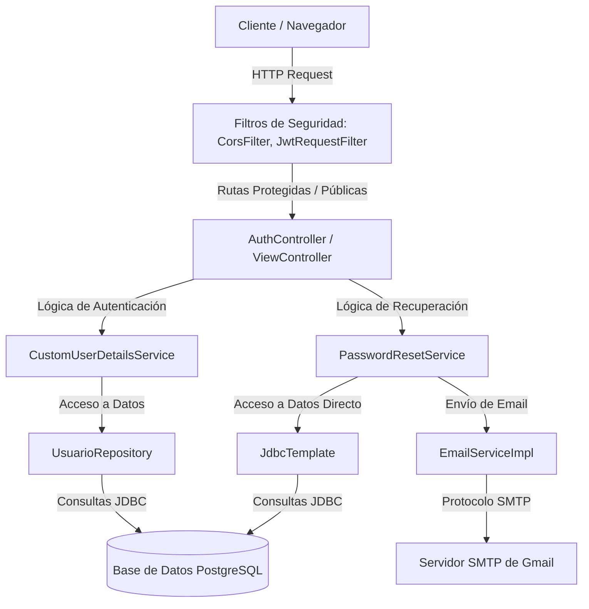
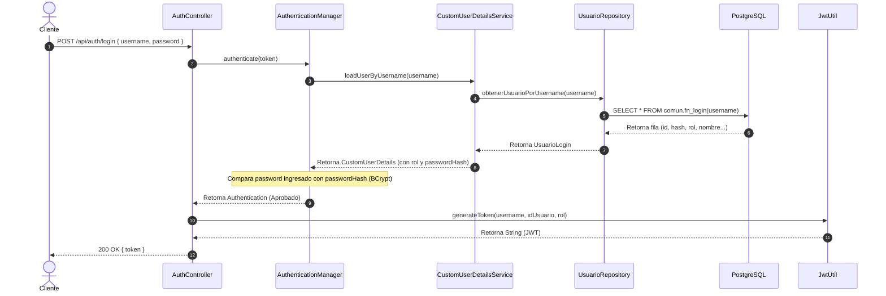

[← Volver al índice](INDEX.md)

# 🏗️ Arquitectura del Sistema - autenticacionWeb

Este documento describe el diseño de software, la estructura modular y los flujos de datos del microservicio `autenticacionWeb`.

---

## 1. Diagrama General de Arquitectura

El microservicio está estructurado bajo el patrón de arquitectura por capas clásico de **Spring Boot**:

---

## 2. Listado de Módulos y Paquetes

La aplicación Java se divide en los siguientes paquetes bajo la raíz `src/main/java/`:

| Paquete | Propósito | Clases Clave |
|---|---|---|
| `main` | Entry point para la inicialización de la aplicación Spring Boot. | `Application.java` |
| `controller` | Controladores REST y MVC de Thymeleaf que exponen las rutas HTTP. | `AuthController.java`, `ViewController.java` |
| `config` | Filtros y reglas de seguridad de Spring Security, y manejo de CORS. | `SecurityConfig.java`, `JwtRequestFilter.java`, `SimpleCorsFilter.java`, `CustomAuthenticationEntryPoint.java` |
| `services` | Implementa la lógica de negocio (carga de usuarios, generación de tokens de restablecimiento y envío de correos). | `CustomUserDetailsService.java`, `PasswordResetService.java`, `EmailServiceImpl.java` |
| `repositorio` | Acceso directo a base de datos PostgreSQL utilizando Spring JDBC. | `UsuarioRepository.java` |
| `autenticacionWeb` | Clases de utilidad para el ciclo de vida de los JSON Web Tokens (JWT). | `JwtUtil.java` |
| `dto` | Data Transfer Objects para serializar y deserializar datos de request/response. | `AuthenticationRequest.java`, `ForgotPasswordRequest.java`, `ResetPasswordRequest.java` |

---

## 3. Flujos Principales de Datos

### Flujo 1: Inicio de Sesión (Login)
Autenticación de un usuario con credenciales y entrega de token JWT de acceso.

* **Punto de Entrada:** `POST /api/auth/login`
* **Datos de Entrada:** `AuthenticationRequest` (JSON con `username` y `password`).
* **Datos de Salida:** `200 OK` con JSON `{ "token": "..." }` o `401 Unauthorized` con `{ "message": "Credenciales inválidas" }`.
* **Efectos Secundarios:** Registro en logs (`auth.log`) indicando el estado del intento de login.
* **Tablas de BD involucradas:** Llama a la función de base de datos `comun.fn_login(username)`. No modifica datos.

---

### Flujo 2: Solicitud de Recuperación de Contraseña
Generación de un token temporal para iniciar el proceso de recuperación de contraseña.

* **Punto de Entrada:** `POST /api/auth/forgot-password`
* **Datos de Entrada:** `ForgotPasswordRequest` (JSON con `username`).
* **Datos de Salida:** `200 OK` con el texto `"Si el usuario existe, recibirás un correo con las instrucciones."`.
* **Efectos Secundarios:** Envío de correo electrónico a través de SMTP de Gmail. Registro de logs de envío.
* **Tablas de BD involucradas:**
  - Lee y actualiza la tabla `comun.admin_usuario`.
  - Campos actualizados: `reset_token` (almacena UUID aleatorio), `reset_token_expiry` (fecha actual + 10 minutos).

---

### Flujo 3: Restablecimiento de Contraseña
Ejecución del cambio de contraseña consumiendo el token temporal de recuperación.

* **Punto de Entrada:** `POST /api/auth/reset-password`
* **Datos de Entrada:** `ResetPasswordRequest` (JSON con `token` y `newPassword`).
* **Datos de Salida:** `200 OK` con `"Contraseña restablecida exitosamente."` o `400 Bad Request` con `"Token inválido o expirado."`.
* **Efectos Secundarios:** Registro en logs del éxito o fallo de la actualización de contraseña.
* **Tablas de BD involucradas:**
  - Lee de `comun.admin_usuario` para buscar el usuario por el token temporal y validar que la expiración sea posterior al momento actual.
  - Actualiza la tabla `comun.admin_usuario`: setea el nuevo `password_hash` (encriptado con BCrypt), y limpia `reset_token` y `reset_token_expiry` (los setea a `NULL`).

---

## 4. Decisiones Técnicas Clave

* **Arquitectura Stateless:** No se hace uso de sesiones HTTP (`HttpSession`) en memoria del servidor. La validación del token JWT en cada petición permite un escalado horizontal transparente del servicio.
* **Spring Security 6+ integrado en Spring Boot 3:** Se usa la API actualizada de configuración de seguridad basada en Lambdas en `SecurityFilterChain`.
* **JdbcTemplate sobre JPA/Hibernate para escritura/lectura crítica:** Al interactuar con funciones almacenadas heredadas (`comun.fn_login`), el uso de `JdbcTemplate` reduce el overhead de un ORM y proporciona consultas de bajo nivel muy veloces.
* **Observabilidad integrada (OTel + Prometheus):** La inclusión de Micrometer Tracing Bridge OTel y Prometheus permite la monitorización en tiempo real de métricas y trazas en un colector compatible (por ejemplo, Jaeger o Prometheus local).

---

> **Nota para IA:** El diagrama Mermaid describe la secuencia y las capas del servicio. Cualquier cambio en las clases que rompa la relación Controlador -> Servicio -> Repositorio debe verse reflejado aquí inmediatamente.

---

## Última revisión
- **Fecha:** 2026-05-25
- **Commit:** `c646311c83eae3bf4759c7ea39bfde2726ff11c9`

---

## Instrucciones para actualizar este doc
- Si cambia un flujo de datos (se añade verificación intermedia, se cambia el método de login o reset) → actualiza `ARCHITECTURE.md`.
- Si se añaden nuevas capas (por ejemplo, una capa intermedia de validación o DTOs) → actualiza la tabla de módulos de `ARCHITECTURE.md`.

[← Volver al índice](INDEX.md)
